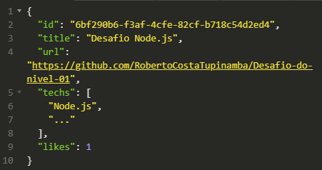

# Desafio: Conceitos do Node.js

Nesse desafio, meu **objetivo** foi criar uma aplicação para treinar o que aprendi até agora no **Node.js**!.

## Instalação

Após a clonagem do projeto execute o comando `yarn` para realizar o download dos arquivos necessários.

## Como iniciar o servidor?

Abra o terminal na pasta do projeto e execute o comando `yarn dev`, após isso o servidor sera iniciado e vigiado pelo
nodemon para atualizar o servidor quando necessário.
Por padrão o servidor estará escutando a porta **3333**.

## Rotas

### - GET

Esta rota deve ser utilizada quando necessita buscar um Array de todos os repositórios.

http://localhost:3333/repositories -> Retorna um array de objetos onde cada um é um repositório.


### - POST

Existe duas rotas com o método **POST**.

#### Criar um repositório

Esta rota espera receber um json com title, url e techs

**Exemplo**

```
{
    title:"Desafio Node.js",
    url:"https://github.com/RobertoCostaTupinamba/Desafio-do-nivel-01",
	techs: ["Node.js"]
}
```

Caso não exista algum desses atributos será retornado um **erro:Invalid body params**.

Se tudo der certo irá retornar o repositório criado com o seu **id**


### Dar like em um repositório
Esta rota espera receber um id na url

**Exemplo**
http://localhost:3333/repositories/**id**/like

Caso tudo de certo sera retornado o repositório que foi incrementado o like



